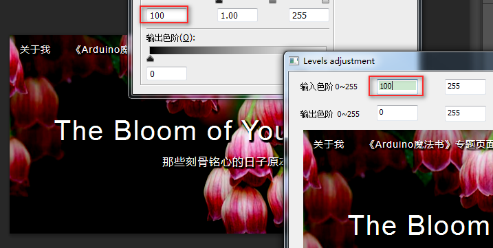
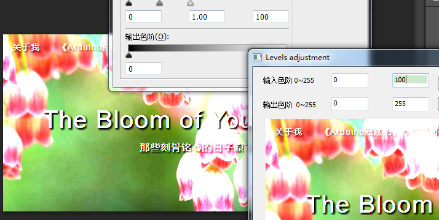
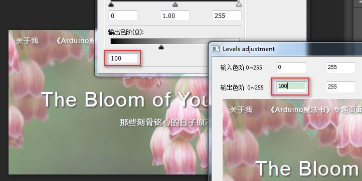

Photoshop中的色阶/曲线命令原理详解与编程实现

算法移值自 [绘云描鲤](!http://kuangqi.me/image-processing/implement-level-and-curves-in-photoshop/)

[Adoble 色阶介绍]
(https://helpx.adobe.com/photoshop/using/levels-adjustment.html)

对比,左边的是Photoshop，右边的是本软件Demo效果。

